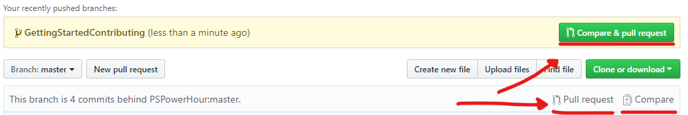

# Table of Contents

* [Contact / Q&A / Further Reading](#contact-/-qa-/-further-reading)
* [Getting Started on OSS Contributions - The Git Hurdle](#getting-started-on-oss-contributions---the-git-hurdle)
    * [Learn By Example: Contributing to PowerShell Core](#learn-by-example-contributing-to-powershell-core)
        * [Install Git](#install-git)
        * [Fork the Repo](#fork-the-repo)
        * [Clone Your Fork](#clone-your-fork)
        * [Add the Main PowerShell Repository as a Remote](#add-the-main-powershell-repository-as-a-remote)
        * [Creating a New Branch](#creating-a-new-branch)
        * [Submitting a Pull Request](#submitting-a-pull-request)
        * [Building PowerShell](#building-powershell)
    * [Keeping Branches Up to Date](#keeping-branches-up-to-date)
        * [Pulling Upstream Commits Into Your Master Branch](#pulling-upstream-commits-into-your-master-branch)
        * [Rebasing A Branch](#rebasing-a-branch)

# Contact / Q&A / Further Reading

* Twitter: [@vexx32](https://twitter.com/vexx32)
* Blog: [Clear-Code](https://vexx32.github.io)

or come find me on [Slack](https://j.mp/psslack) / [Discord](https://j.mp/psdiscord)!

# Getting Started on OSS Contributions - The Git Hurdle

A lot of us PowerShell folks have one foot in the developers' dorm room door in our daily life.
I have seen on several occasions that the main barrier to contributing back to the tools we use can
easily just be a matter of _I don't know how_.
After all, many of the tools we use _are_ open source, and for the vast majority of us our favourite
tools are actually _written_ in PowerShell code; our favourite modules are often largely native
code, though there are several that may be compiled cmdlets instead.

Those of us who _have_ worked with **git** before will know some or all of the topics being
discussed here, but for those of us less familiar, I will cover the topic from the absolute basics,
step by step.

## Learn By Example: Contributing to PowerShell Core

The first things you will need in order to make this happen are:

* Git
* A GitHub account

Although, depending on where the original project is hosted, you may instead wish to use a BitBucket
or other git-hosting website for ease of interaction.

### Install Git

[Download Git](https://git-scm.com/downloads)

In the above link, you'll find download links for most common operating systems.
Download and install the application per the instructions.
On Windows it includes a GUI interface as well as the standard command line.
However, I have found that the command line is a bit easier to work with, as a majority of online
instructions work with the command line primarily.
If your editor of choice (I'll be using VS Code here) includes Git integration, these GUI options
are often much easier to use.

Once done, verify `git` has been added to your `$env:Path` variable by calling it from a console
window; this guide will assume you're using PowerShell as your console of choice, as it will be
required to set up your build environment.

### Fork the Repo

[Sign up to GitHub](https://github.com/join)

Once you have a GitHub account, the first thing you'll need to do when starting to work with an
open source repo is to **fork** it.
This creates a copy of that repository in your own GitHub account, which will be necessary in order
to create new branches and do all necessary preparation for a pull request.

To **fork** the [PowerShell/PowerShell](https://github.com/PowerShell/PowerShell) repository, go to
the main repository page and click the **Fork** button in the top-right of the main page.


This will create a copy of the repository housed under your own account.

### Clone Your Fork

Once you've been redirected to the new repository page, you can get the clone link from your own
repository.
Select the green **Clone or Download** button, and then copy the link from the popup pane.


Now, drop into your favourite command line console and navigate to a folder you would like to clone
the repository to.
To clone the repository, enter the following command:

```powershell
git clone <URL> [<Folder>]
```

Where `<URL>` is the URL to the `.git` file that the clone link specifies, and `<Folder>` is the
folder you would like the repository cloned into.
The default folder `git` creates matches the name of the repository itself.
In this case, the URL should be `https://github.com/PowerShell/PowerShell.git` and the folder
name can be left blank (`git` will create a folder called `PowerShell` for us).
Your full command should look like this:

```powershell
git clone https://github.com/PowerShell/PowerShell.git
```

### Add the Main PowerShell Repository as a Remote

What we're going to do now will allow you to keep your own repository up to speed with the official
PowerShell repository without having to constantly make merge commits or otherwise terribly clutter
your commit history.

```powershell
git remote add upstream https://github.com/PowerShell/PowerShell.git
```

`upstream` will be the name of the new remote.
You can use whatever name you prefer, but I would recommend picking something you can easily recall.

### Building PowerShell

Building PS is quite straightforward:

1. `Import-Module .\build.psm1`
2. `Start-PSBuild -Clean`

### Creating a New Branch

For this, I like to use VS Code's UI options to create new branches, but you can also just use the
`git checkout -b <NAME>` command to create a branch and switch to it.

### Submitting a Pull Request

When you've some changes to contribute, it's time to submit your Pull Request and open it up to
review. You'll see the CI/CD triggers kick in and run the standard battery of tests, including code
style checks and tests for PowerShell features and cmdlets.

Head on back to your repository page on Github and select the Compare button from your branch's main
Code page. Select the parent repository's `master` branch, and you're ready to roll!



Make sure you give your pull request a _descriptive_ and relevant title, as well as summarising the
changes you've made in the PR description.

_Note:_ if you're opening the pull request to fix an outstanding issue, be sure to notate the issue
you're fixing by including `Fixes #<IssueNumber>` in the description. Use of this verb or similar
verbs in its place (e.g., `Resolves`, `Closes`) will allow Github to automatically mark the relevant
issue as closed when your changes are merged into the master branch.

From this point on, the PowerShell team and repository collaborators will be able to check out your
work and offer feedback.

## Keeping Branches Up to Date

The official PowerShell repository is far from frozen, and you'll often see that they've pushed a
handful of new commits every couple of days. To keep pace, you need to do two things:

1. Keep your master branch clean and use it only to receive updates from the main `master` branch.
    * In other words, _always_ operate on a secondary branch when making changes, never `master`.
2. Periodically rebase your side branch using the master branch to incorporate new commits.

### Pulling Upstream Commits Into Your Master Branch

Note I used the word `upstream` once again; this is what that remote pertains to.
Every few days, or probably at least once a week &mdash; and _definitely_ before submitting any kind
of pull request or creating a new branch, you should pull in commits from your upstream source on an
open source project.
In our case, that's the main PowerShell repository, and that's why we configured an upstream remote.

To pull in commits from our upstream remote, we can use the following commands:

```powershell
git checkout master # If we're not currently on master branch
git pull upstream master
git push # to update our original remote master branch
```

### Rebasing A Branch

There are a couple of slightly more involved steps here that must be followed, or else you may find
that you multiply your commits unnecessarily.
Essentially what we'll be doing is temporarily removing our own commits on the branch, adding in the
new commits from our `master` branch, and then reapplying the commits from our branch.
`git` will be doing most of the heavy lifting, as per usual.
I like to use the interactive rebase tools to help tidy my commits at the same time.

```powershell
git checkout <BRANCH_NAME> # make sure you're on the right branch!
git rebase -i master
```

After a few moments processing, `git` will give you a commits file to edit, where you can opt to
`squash` (combine), `drop` (delete), or `pick` (keep) specific commits.
Once done, save and close the file.
If you're using Git for Windows, the default editor is a Nano-like interface; once you're done
editing, just hit `Ctrl+X` to close the file, following by `Y` to save changes.

_Notes for rebasing:_

* If you encounter a conflict, always accept the incoming change until you reach your own commits
    * In other words, don't overwrite previous commits with your changes; leave that for your actual commits to do
* If you notice it's getting out of hand with conflicts, you always have the `git rebase --abort` option!

And, _most_ importantly, VS Code (and probably other editors) have a usually-very-handy Sync button;
***avoid*** this when rebasing.
When you're done rebasing, instead of just syncing, or doing a regular `git push`, you will notice
if you check `git status` (it will be shown in the Sync button display in VS Code as well) that you
are _both_ ahead and behind the remote branch after a rebase.
**This is normal.**

To complete the rebase withot multiplying your commits, _always_ make sure that the final step is:

```powershell
git push --force-with-lease
```
